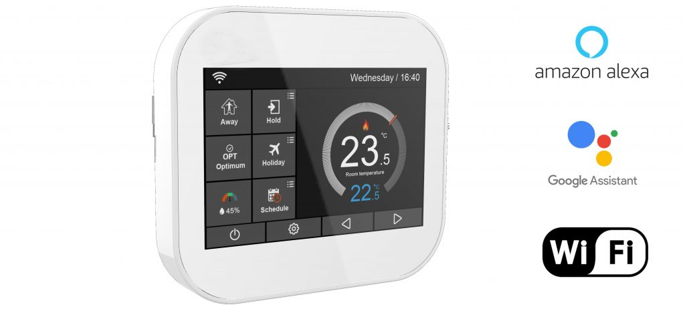

# MC6_Thermostat
API for Home Assistant

import requests

# MC6 API Class
class MC6:

    Username=""
    Password=""
    language="2"
    sessioncookie=""
    payload=""
    mc6_mac="cc50e3ebd310"
    # mac_id=cc50e3ebd310
    
    def __init__(self, username, password):
        self.username=username
        self.password=password
        
    def connect(self):
        #
        print("Connecting with username: " + self.username + " password: " + self.password)
        payload = {'password':self.password, 'name':self.username, 'language':self.language}
        #
        r = requests.get("http://www.bradecontrols.com/api.php/User/login?", params=payload)
        #
        if r.status_code == requests.codes.ok:
            print(r.headers['content-type'])
            print(r.cookies.get_dict())
            print("------------------login------------------")
            content = r.json()
            print(content)
            print(content['result'])

            if 'u_id' in content['info']:
                #raise ValueError("No target in given data")
                self.u_id = content['info']['u_id']
                print(content['info']['u_id'])
            else:
                print("Error msg " + content['msg'])
                
    #
    def locate_device(self):
        payload = {'u_id':self.u_id}
        r = requests.get("http://www.bradecontrols.com/api.php/Index/my_address?", params=payload)
        if r.status_code == requests.codes.ok:
            print(r.headers['content-type'])
            print(r.cookies.get_dict())
            print("------------------my_address------------------")
            content = r.json()
            print(content)
            self.a_id = content['info'][0]['a_id']
            self.a_name = content['info'][0]['a_name']
            self.temper_type = content['info'][0]['temper_type']
            self.lon = content['info'][0]['lon']
            self.lat = content['info'][0]['lat']
            
    # GEAT A LIST OF THE AVAILABLE DEVICES IN THE HOUSE
    def get_index(self):
        # str() int()
        headers = {'Content-Type': 'application/x-www-form-urlencoded', 'Host': 'www.bradecontrols.com',
        'User-Agent': 'www.bradecontrols.com', 'Cookie': 'PHPSESSID=v6chtn5dduu8p27ro04c351jse',
        'Cookie2': '$Version=1', 'Accept-Encoding': 'gzip'}
        #
        payload = {'u_id':self.u_id, 'a_id':self.a_id, 'long':self.lon, 'lat':self.lat}
        #
        r = requests.get("http://www.bradecontrols.com/api.php/Index/index?", params=payload, headers=headers)
        #
        if r.status_code == requests.codes.ok:
            print(r.headers['content-type'])
            print(r.cookies.get_dict())
            print("------------------index------------------")
            content = r.json()
            print(content)
            # {"result":"succ","info":{"a_id":"8184","a_name":"Casa","distance":0,"lon":"116.459198","lat":"39.885504",
            # "eq_list":[{"eq_id":"9714","eq_name":"Sala da pranzo","tempera":"23.8","e_tempera":"17.5","speeds":"4",
            # "humidity":"36","antifreeze":"7","leave_days":"1","temper_type":"0","time_zone":"0","pattern":"5","versions":null,
            # "leavestate":"1","optimized_startup":"0","temperature_difference":"0.5","holding_temperature":"25","holding_time":"0",
            # "holiday":"0","holiday_startime":"0","holiday_endtime":"0","standbys":"1","pattern_name":"\u6b63\u5e38","state":"1",
            # "e_id":"2"}],"temper_type":0},"msg":""}

            self devices_list = content['info']['eq_list']
            self.eq_id = content['info']['eq_list'][0]['eq_id']
            self.eq_name = content['info']['eq_list'][0]['eq_id']
            self.temperatura = content['info']['eq_list'][0]['tempera']
            self.e_tempera = content['info']['eq_list'][0]['e_tempera']
            self.humidity = content['info']['eq_list'][0]['humidity']
            
            print("Devices list: " + self.devices_list)
            print("ID dispositivo: " + self.eq_id + " nome dispositivo: " + self.eq_name)
            print("Temperatura: " + self.temperatura + " tempeartura impostata: " + self.e_tempera + " umidità: " + self.humidity)
            
            
    def read_device(self):
        #
        payload = {'u_id':self.u_id, 'e_id':self.eq_id}
        r = requests.get("http://www.bradecontrols.com/api.php/Equipment/eq_read?", params=payload)
        #
        if r.status_code == requests.codes.ok:
            print(r.headers['content-type'])
            print(r.cookies.get_dict())
            print("------------------read device------------------")
            content = r.json()
            print(content)
            
#
print("Running")
#
Thermo = MC6("YOUR_USERNAME", "YOUR_PASSWORD")
# Connect to the app server
Thermo.connect()
# Locate the device
Thermo.locate_device()
# 
Thermo.get_index()
#
Thermo.read_device()
